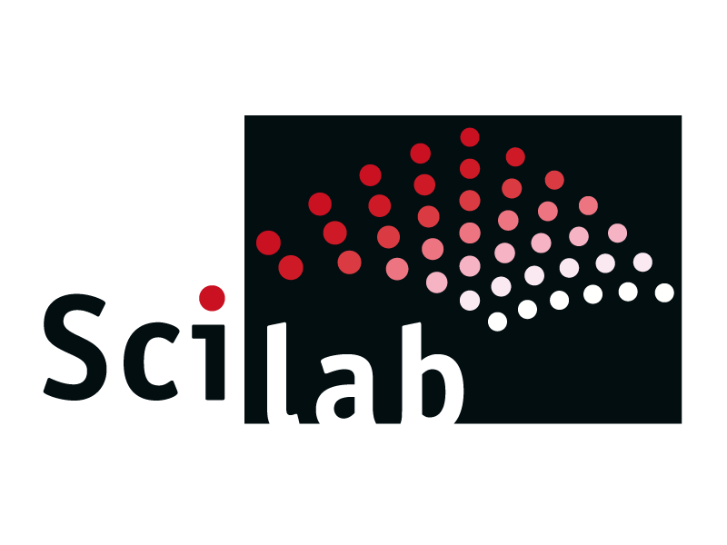

# Hi, I'm Tofig Nazarbayov!👋

# I'm a Geophysicist and Developer!

* 🔭 I have master degree in Geophysics and passionate about Machine Learning
* 👯 I’m looking to collaborate with other ML/DL researchers
* 🥅 I enjoy contributing to Open Source projects
* ⚡ Fun fact: I write poems on different languages

Website: https://seryozni.github.io

Linkedin: https://linkedin.com/in/tofignazarbayov

# Languages and Tools:

 
 
 

# Support me:

You can support me by sending some crypto to the following Litecoin address:

LTC: ltc1qpgdgnmmqyygh3fu3g46ls8j48p9fmgxv8frse2

